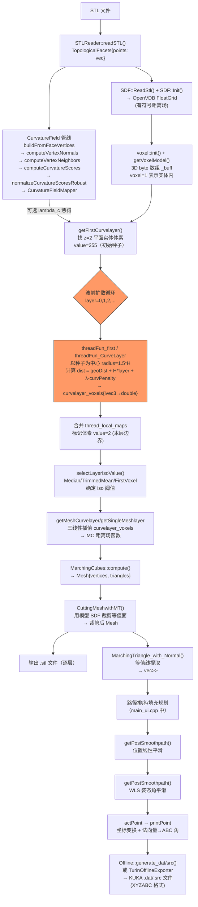

# 现有项目深度分析报告

> 本文件对应任务第 1 步，纯现状分析，不含任何重写建议。

---

## 一、模块清单

### 项目整体文件布局

```
project/
├── main.cpp               (1064 行) — OpenGL/ImGui 主渲染循环
├── main_ui.cpp            (2019 行) — UI 面板 + 算法调度中枢
├── main_ui.h               (314 行) — MainUI 类定义，static 全局标志位
├── file.cpp/.h            (342/19 行) — 文件对话框封装
├── AppLog.h                (284 行) — 结构化日志
├── Profiler.h               (86 行) — 函数耗时宏
├── Dual_Contouring.cpp/.h (117/41 行) — DC 算法（已注释掉，不在主流程）
├── ToolUtils.cpp/.h      (101/70 行) — 杂项工具（string_format 等）
├── basicDataType/
│   ├── STLReader.cpp/.h   (170/45 行) — 二进制/ASCII STL 读取
│   ├── Slicer.h/cpp       (493/106 行) — 传统平面切片（与主算法并存）
│   ├── TopologicBuilder*.cpp        — 拓扑网格构建（三个文件共 ~1200 行）
│   ├── TEACDef.h           (544 行) — Cubef、VoxelBase 等基础数据类型
│   └── TEACUtil.h          (558 行) — 工具函数
├── SUPPORT_FREE_PRINT/              — 核心算法（见下）
├── GLutils/                         — OpenGL 渲染底层
└── Simulation/                      — 路径动画模拟
```

### SUPPORT_FREE_PRINT/ 核心模块

| 模块 | 文件 | 代码行 | 职责摘要 |
|------|------|--------|----------|
| **SFF（波前算法）** | `SFF.h`(213) + `SFF.cpp`(1585) | **1798** | voxel 类 + 波前距离场扩散 + MC 等值面调度 |
| **SDF（有符号距离场）** | `StlToSDF.h`(202) | 202 | 用 OpenVDB 将 STL 转为浮点 SDF 网格 |
| **MarchingCubes** | `MarchingCubes.h`(67) + `.cpp`(795) + `MCLookUp_Table.h`(1363) | **2225** | 拓扑保证的 MC，25 对称查找表 |
| **MarchingTriangles** | `MarchingTriangles.h`(210) + `.cpp`(1927) | **2137** | 三角网格等值线提取 + 网格裁剪 |
| **CurvatureField** | `CurvatureField.h`(88) + `.cpp`(548) | **636** | 离散曲率计算 + 最近邻查询惩罚 |
| **pathPostprocessing** | `pathPostprocessing.h`(41) + `.cpp`(335) | **376** | WLS 滤波姿态平滑 + 线性位置平滑 |
| **Offline（KUKA 导出）** | `Offline.h`(70) + `.cpp`(340) | **410** | 生成 KUKA KRL .src/.dat 文件 |
| **TurinOfflineExporter** | `TurinOfflineExporter.h`(63) + `.cpp`(176) | **239** | 第二家机器人品牌导出器（实现 IRobotOfflineExporter） |
| **IRobotOfflineExporter** | `IRobotOfflineExporter.h`(17) | 17 | 导出器抽象接口 |
| **DataStructs** | `DataStructs.h`(189) | 189 | printPoint、actPoint、dis_voxel、Mesh、Rect3 |
| **SpatialProperty** | `SpatialProperty.h`(176) | 176 | SDF 树节点、布尔运算操作码（未被主流程使用） |
| **exact_geodesic** | `exact_geodesic.h`(191) + `.cpp`(1607) | **1798** | Kimmel-Sethian 精确测地线（用于热力图显示，不在切片主流程） |
| **collisionDetection** | `collisionDetection.h`(131) | 131 | 碰撞检测模板（未被主流程实际调用） |
| **clipper** | `clipper.cpp`(4629) | 4629 | Clipper 多边形裁剪库（第三方，路径规划辅助） |
| **BSpline / curveFitting** | 多文件 | ~400 | B 样条、Bezier、Catmull-Rom（作用不明确，未在主流程看到调用） |
| **CSLCReader** | `CSLCReader.h/cpp` | ~197 | SLC 格式读取（备用输入格式） |
| **UDPConnect** | `UDPConnect/` | ~100 | UDP 通信（已注释掉） |

**总计核心算法代码约 16000 行。**

---

## 二、数据流图



**关键数据结构转换链：**
```
TopologicalFacets → OpenVDB FloatGrid → voxel._buff (byte[]) 
→ curvelayer_voxels (phmap<ivec3, double>)
→ Fun3s (lambda 距离场函数)
→ Mesh{vec<vec3>, vec<array<int,3>>}
→ vec<vec<vec<actPoint>>> (layers×contours×points)
→ vec<printPoint> (XYZABC+E1E2+wireFeedRate)
→ KUKA .dat/.src 文本文件
```

---

## 三、依赖关系

### 模块依赖图（实线=直接 include，从上游到下游）

```
STLReader ──────────────────────────────────► basicDataType/TEACDef
                                              (Cubef, VoxelBase, TopologicalFacets)

SDF (StlToSDF.h) ─────────────────────────► OpenVDB
                 ─────────────────────────► basicDataType/TEACDef (Cubef)

CurvatureField ───────────────────────────► glm

DataStructs ──────────────────────────────► SpatialProperty ──► TEACDef
            ──────────────────────────────► Eigen
            ──────────────────────────────► MeshReconstruction (hash funcs)

MarchingCubes ────────────────────────────► DataStructs
              ────────────────────────────► GMP

MarchingTriangles ────────────────────────► DataStructs
                  ────────────────────────► GMP
                  ────────────────────────► phmap (parallel_hashmap)
                  ────────────────────────► Eigen

SFF ─────────────────────────────────────► StlToSDF (SDF)
    ─────────────────────────────────────► MarchingCubes
    ─────────────────────────────────────► MarchingTriangles
    ─────────────────────────────────────► CurvatureField
    ─────────────────────────────────────► DataStructs
    ─────────────────────────────────────► Eigen
    ─────────────────────────────────────► phmap
    ─────────────────────────────────────► basicDataType/TEACDef (TEAC 宏)

pathPostprocessing ───────────────────────► DataStructs
                   ───────────────────────► Eigen (稀疏矩阵 SimplicialCholesky)

Offline ──────────────────────────────────► DataStructs

TurinOfflineExporter ─────────────────────► IRobotOfflineExporter
                     ─────────────────────► DataStructs
                     ─────────────────────► Eigen

main_ui ─────────────────────────────────► SFF
        ─────────────────────────────────► Slicer, STLReader
        ─────────────────────────────────► CurvatureField
        ─────────────────────────────────► exact_geodesic
        ─────────────────────────────────► Offline / TurinOfflineExporter
        ─────────────────────────────────► pathPostprocessing
        ─────────────────────────────────► GLutils, ImGui

main ────────────────────────────────────► main_ui（单向）
     ────────────────────────────────────► GLutils, ImGui
```

### 是否有循环依赖？

**没有严重的循环依赖**。主要依赖方向是单向的：

```
basicDataType → (无内部依赖)
SDF / CurvatureField → basicDataType
DataStructs → SpatialProperty → basicDataType
MarchingCubes/Triangles → DataStructs
SFF → MarchingCubes + MarchingTriangles + SDF + CurvatureField + DataStructs
pathPostprocessing → DataStructs
Offline/TurinExporter → DataStructs
main_ui → SFF + Offline + pathPostprocessing + exact_geodesic + Slicer + GLutils
main → main_ui + GLutils
```

**潜在问题**：`DataStructs.h` include `SpatialProperty.h`，而 `SpatialProperty.h` include `basicDataType/TEACDef.h`（通过 GLDataDef.h），而 TEACDef.h 又定义了 VoxelBase 和 Cubef，这条链有些深，但不构成循环。

---

## 四、补丁识别

以下代码片段具有"打补丁"性质，重写时需要有意识地处理。

### 4.1 曲率惩罚项（后加功能，物理意义模糊）

**位置**：`SFF.h` L145-148；`SFF.cpp` 在**两个**波前函数中都被调用：
- `threadFun_first` L1095-1100（第一层扩散）
- `threadFun_CurveLayer` L1155-1160（后续各层扩散）

```cpp
// SFF.cpp:1100 (threadFun_first)
float curvPenalty = 0.0f;
if (use_curvature_penalty) { curvPenalty = getCurvaturePenalty(x_, y_, z_); }
float disVal = sign * geoDist + static_cast<float>(lambda_c) * curvPenalty;

// SFF.cpp:1160 (threadFun_CurveLayer)
double disVal = geoDist + heightInterval * layer + lambda_c * curvPenalty;
```

- 加入 `lambda_c * curvPenalty` 将表面曲率高的地方的距离场值人为增大
- `CurvatureFieldMapper::queryNearestVertex()` 是 O(n) 暴力最近邻，n 是网格顶点数，每次查询都遍历全部顶点——性能陷阱
- 物理语义不清：为什么曲率高的地方层间距要增大？文档中未说明
- `use_curvature_penalty = false` 为默认值，说明这个功能本身还不稳定
- 补丁面积比单点大：两个波前阶段都注入了相同的惩罚逻辑，重写时要一并清除

### 4.2 旧波前代码残留（`#if 0` 块）

**位置**：`SFF.cpp` L1391-1431（`#if 0` ... `#else`）

```cpp
#if 0
// 旧方案：全局扫描所有体素找下一层种子 O(N³)
for (int z_ = v.get_max_Z_num(); z_ >= 2; z_--)
    for (int y_ ...) for (int x_ ...)
        if (v.getVoxel(x_,y_,z_) == 2) { ... }
#else
// 新方案：从上一层种子点局部搜索 O(seeds × searchRange³)
for (const auto& parent_pt : next_initVoxels) { ... }
#endif
```

这是典型的补丁痕迹——旧逻辑用 `#if 0` 封存而非删除。

### 4.3 等值面阈值选择器（为解决数值不稳定打的补丁）

**位置**：`SFF.h` L43-47，`SFF.cpp` L125-184

```cpp
enum class IsoSelectionMode { FirstVoxel = 0, Median = 1, TrimmedMean = 2 };
```

这三种模式是为了解决 `voxel_layer[seed]` 值不稳定（多线程写入时取最小值，导致不同轮次种子集合对应的 iso 值波动）而后加的。重写时应从算法层面解决，而不是用统计选择 iso 值来掩盖。

### 4.4 姿态平滑中的无效参数（`out_point` 参数为死代码）

**位置**：`pathPostprocessing.cpp` L104-154

```cpp
auto smoothAngle = [](const Eigen::Vector3d& axis,
                      vector<actPoint>& projVec,  // 实际修改 Proj_ 的
                      vector<actPoint>& out_point) // 从未使用，死参数
{
    // ...
    projVec[i].Proj_ = rotation_vector.matrix() * axis; // 修改 projVec 原地
};
// 调用处
smoothAngle(z_axis, original_path[l][i], out_path[l][i]); // out_path 参数无效
out_path[l][i] = original_path[l][i]; // 然后覆盖赋值
```

`smoothAngle` 对 z/y/x 轴各做一次 WLS 滤波+重建，但三次串行叠加的方式并不是在球面上的联合平滑，几何语义不严格。

### 4.5 朝向平滑中的方案存疑

**位置**：`pathPostprocessing.cpp` L130-154

```cpp
// WLS 平滑后的角度 angle_filt[i]
// 然后从 axis（固定方向）出发，旋转 angle_filt[i] 度
projVec[i].Proj_ = rotation_vector.matrix() * axis;
```

这会把所有点的姿态强制约束到 axis 平面内（丢失了方位角分量），不是真正的角度轨迹平滑。属于算法不完整的补丁。

### 4.6 GMP 高精度计算（为拓扑正确性打的补丁）

**位置**：`MarchingTriangles.cpp` L40-118（`MTCuttriangleVertex`/`MTLerpCubeVertex`）

插值用 GMP 的 `mpf_t` 做任意精度运算，但 `getGridPosition` 仍用 `float`。GMP 带来巨大运行时开销（每次插值分配/释放数十个 mpf 对象），引入原因是 Marching 插值导致拓扑退化，用高精度掩盖问题。重写时应从算法上保证鲁棒性而非用 GMP。

---

## 五、可复用模块

以下模块代码质量相对较好，重写时可原样或小改迁移：

### 5.1 ⚠️ MarchingCubes（算法主体可复用，但 GMP 渗透严重，不是"直接迁移"等级）

- `MarchingCubes.cpp`：拓扑保证算法，25 对称查找表，正确处理了所有歧义情形
- 接口设计合理：输入 `Fun3s`（任意距离场函数）+ 包围盒 + 分辨率
- **需要改动**：
  - **MarchingCubes 本体也使用 GMP**（`MarchingCubes.cpp` 中 `mpf_t` 相关调用 7 处，`MarchingCubes.h` 1 处），并不是"只有 MarchingTriangles 用"。剥离 GMP 是一次性改造，两者一起做
  - 整理 `#ifdef USE_OPENMP` 分支
  - 建议：重写时从 `Fun3s` 接口直接复用，但插值/顶点计算实现需要换成 double（或双重精度回退策略），不能原样迁移带 GMP 的部分

### 5.2 ✅ CurvatureField（接口干净，可复用，优化查询性能）

- 管线设计清晰：`buildFromFaceVertices → computeVertexNormals → computeVertexNeighbors → computeCurvatureScores → normalizeCurvatureScoresRobust`
- 每个函数职责单一，没有副作用
- **需要改动**：`queryNearestVertex` 替换为 KD 树或 BVH，避免 O(n) 遍历

### 5.3 ✅ pathPostprocessing（WLS 滤波部分）

- `wlsFilter1d()`：正确实现了 1D WLS（加权最小二乘）平滑，用 Eigen 稀疏矩阵求解
- `LinearSmooth31/51()`：标准滑动平均，代码简洁
- **需要改动**：`smoothAngle` 的几何逻辑（见补丁 4.5），位置平滑部分可直接复用

### 5.4 ✅ IRobotOfflineExporter + TurinOfflineExporter（接口设计合理）

- `IRobotOfflineExporter` 纯虚接口定义干净
- `TurinOfflineExporter` 实现完整（相比 Offline.cpp 更规范）
- **可直接迁移**，只需更新 include 路径

### 5.5 ✅ DataStructs 中的 printPoint / actPoint

- `printPoint`：XYZABC + E1/E2 + wireFeedRate + typeOfPoint（start/end/common/noFill）语义完整
- `actPoint`：Position\_ + Proj\_（位置+法向量）设计合理
- **可直接复用**，但建议将 `Eigen::Vector3f` 统一为 `Eigen::Vector3d`

### 5.6 ✅ STLReader（读取逻辑）

- `basicDataType/STLReader.cpp`：处理了二进制和 ASCII STL，170 行，简洁
- **可直接复用**

---

## 六、必须重写的模块

### 6.1 ❌ SFF.cpp 的波前算法（核心算法）

**文件**：`SFF.cpp` L667-1583（`getFirstCurvelayer`, `getDistanceFiled`, `threadFun_first/CurveLayer`）

**问题清单**：

1. **不是真正的测地线距离**：使用欧氏距离 `glm::distance()` 代替网格面上的测地线距离。在弯曲表面上，欧氏距离与测地线距离差异可能达到 30%+。

2. **第一层种子点固定在 z=2**（`SFF.cpp` L687）：
   ```cpp
   for (int z = 2; z < 3; z++) {  // 写死 z=2
   ```
   这意味着打印平台必须水平，且模型必须从 z=2 开始有实体。对倾斜底座或复杂几何完全失效。

3. **波前扩散复杂度高**：
   - `threadFun_CurveLayer` 对每个种子点扫描 `(3 × heightInterval + 1)³` 个邻居
   - heightInterval 通常为 10-20 个体素，则每个种子点扫描 ~9000-68000 个体素
   - 全局合并时用 mutex 串行化，多线程收益被抵消

4. **缺少体内约束**：距离场扩散不区分实体内外，只检查 `bDotInBox`（包围盒内），导致距离值可以穿过空气扩散到实体之外的空白区域

5. **voxel 类承担过多职责**：既是体素存储，又是距离场计算器，又持有 SDF/CurvatureFieldMapper，完全违背单一职责原则

6. **算法与论文不符**：目标算法（Laplacian 扩散 + Poisson）需要全局求解，而当前实现是局部 BFS 近似，不能正确处理凹形曲面

### 6.2 ❌ main_ui.cpp（UI 与算法强耦合）

**文件**：`main_ui.cpp` 2019 行

- 算法参数（精度、层高、KUKA 配置、曲率权重）全部作为 ImGui 控件直接写进 UI 逻辑
- 算法调用（`getDistanceFiled`, `MarchingTriangle_with_Normal` 等）散布在 UI 回调中
- 用 `static std::atomic<bool>` 全局标志位在 UI 线程和算法线程间通信（容易出现竞争条件）
- 路径规划的核心逻辑（等值线排序、连通域合并、填充路径生成）全部在这里，没有独立的路径规划模块

### 6.3 ❌ MarchingTriangles.cpp + MarchingCubes.cpp（GMP 依赖 + 职责过重）

**文件**：`MarchingTriangles.cpp` 1927 行，`MarchingCubes.cpp` 795 行

- **GMP `mpf_t` 渗透两个文件**：MT.cpp 10 处、MT.h 1 处、MC.cpp 7 处、MC.h 1 处（共 19 处）。每次插值分配 ~15 个 mpf 对象，是 float 计算的 100x 代价。两个文件需联合改造
- MT 同一文件混合了：等值线提取、网格裁剪、法向量传播、轮廓排序、调试变体函数
- `MarchingTriangle_with_Normal` 和 `MarchingTriangle_with_Normal_debug` 代码近乎重复

### 6.4 ❌ Offline.cpp（KUKA 导出，大量硬编码）

**文件**：`Offline.cpp` 340 行

- S/T/toolnum/basenum 直接硬编码在默认构造函数（`Offline.h:14`：`S(4), T(28), toolnum(8), basenum(6)`）
- `platform_z + 0.28` 硬编码为打印平台高度偏移，**在 `Offline.cpp:40/46/51/56` 共 4 处重复出现**，无法从配置读取
- 生成 KRL 代码的字符串用多次 `<<` 拼接，维护极其困难
- 不支持 KUKA 关节极限检查（没有角度范围验证）
- 已有 `TurinOfflineExporter` 实现了 `IRobotOfflineExporter` 接口，`Offline.cpp` 应当重写为同样实现此接口

---

## 七、隐藏依赖与陷阱

### 7.1 硬编码常量

| 位置 | 常量值 | 含义 | 风险 |
|------|--------|------|------|
| `SFF.cpp:687` | `z = 2` | 第一层种子从 z=2 开始 | 不能处理任意底面几何 |
| `SFF.h:140` | `_thread_num = 12` | 固定 12 个工作线程 | 超线程机器上资源浪费 |
| `SFF.cpp:1311` | `thread_num = 24` | 合并阶段另有 24 线程 | 与上面的 12 线程不一致 |
| `Offline.h:14` | `S(4), T(28), toolnum(8), basenum(6)` | KUKA 状态/转型/工具/基座参数（默认构造函数，位于头文件 inline 初始化列表） | 换模型或位置就错 |
| `Offline.cpp:40, 46, 51, 56` | `platform_z + 0.28`（**共 4 处**） | 平台高度偏移 0.28mm，分布在 4 个 E6POS 初始化字符串中 | 更换打印基底时需逐处改，极易遗漏 |
| `StlToSDF.h:196` | `_voxel_size = 0.5` | OpenVDB 体素尺寸 | 和 `voxel::_precision` 不统一 |
| `MarchingTriangles.h:38` | `p_resolution = 0.05f` | 路径点分辨率 | 全局 const，无法按模型调整 |
| `main.cpp:286` | `300 * 1000000` | 路径缓冲区分配 300M 点 | 现已改为动态估算，但注释保留旧值 |

### 7.2 写死的坐标轴方向

- `getFirstCurvelayer()` 假设打印方向沿 **+Z 轴**（z=2 作为底面），对 KUKA 6 轴系统中任意倾斜打印无效
- `pathPostprocessing.cpp` 中 `z_axis(0,0,1)` 硬编码为世界坐标 Z 轴，用于姿态平滑
- `Offline.cpp` 中坐标变换 `(-X + platform_x, -Y + platform_y, Z + platform_z)` 假设了特定的机器人基坐标系方向（X/Y 取反）

### 7.3 全局状态与竞争条件

`main_ui.h` 中定义了多个 `static std::atomic<bool>` 标志位：
```cpp
static std::atomic<bool> voxelFlag;    // 体素计算完成
static std::atomic<bool> curveFlag;   // 曲面层计算完成
static std::atomic<bool> curvePathFlag; // 路径规划完成
static std::atomic<bool> pos_flag;
static std::atomic<bool> robotflag;
static std::atomic<bool> simulationFlag;
```

算法在独立线程中运行并修改共享数据（`main_ui.voxels`, `main_ui.curvepaths` 等），UI 线程在下一帧读取这些数据时没有额外保护。`atomic<bool>` 只保证标志位本身的原子性，不保护它们保护的向量数据。

### 7.4 两套 voxel_size 不同步

- `SDF::_voxel_size = 0.5`（StlToSDF.h，OpenVDB 体素尺寸）
- `voxel::_precision`（SFF 体素精度，由 UI 参数传入，通常也是 0.5）

两者含义相同，但是独立设置，如果用户通过 UI 修改了体素精度，`SDF._voxel_size` 不会同步更新——这是一个潜在的不一致 bug。

### 7.5 SDF 与 voxel 坐标系偏移

`voxel::getVoxelModel()` 中体素与 SDF 查询时有半体素偏移：
```cpp
// SFF.cpp:467
sd.Query(_box.min.x + _x * _precision + half_res,  // +0.5*precision
         _box.min.y + _y * _precision + half_res,
         _box.min.z + i  * _precision + half_res)
```

而 `voxelDisplay()` 中显示体素中心时：
```cpp
// SFF.cpp:519
double dx = x * _precision + _box.min.x;  // 无 half_res
```

两处坐标的原点定义不同（一处是体素中心，一处是体素角点），会导致显示坐标与查询坐标偏移半个体素。

### 7.6 OpenVDB 初始化全局单例

`StlToSDF.h` 中：
```cpp
static void Initialize() { ::initialize(); } // OpenVDB 全局初始化
```

必须在第一次使用 SDF 前调用一次，且只能调用一次。当前在 main_ui.cpp 中手动调用，如果重写时忘记，会导致运行时崩溃，且错误信息不直观。

### 7.7 `bDotInBox` vs `isInsideIndex` 语义不一致

```cpp
bool voxel::bDotInBox(int px, int py, int pz)
{
    // SFF.cpp:602: 范围是 [0, max_num)，不含 max_num
    if ((px >= 0 && px < _max_num.x) && ...)
}

bool voxel::isInsideIndex(int px, int py, int pz)
{
    // SFF.h:105: 范围是 [0, max_num]，含 max_num
    return px >= 0 && px <= _max_num.x && ...
}
```

`bDotInBox` 和 `isInsideIndex` 的边界语义不同（一个是 `<`，另一个是 `<=`），两者在不同场景下混用，可能导致越界读取 `_buff`。

---

## 八、第三方库依赖汇总

| 库 | 用途 | 引入方式 | 风险等级 |
|----|------|----------|----------|
| **OpenVDB** | STL → SDF (`StlToSDF.h`) | vcpkg | 🔴 重量级，编译慢，静态链接大 |
| **GMP** | MC/MT 插值精度 (`MarchingTriangles.cpp`) | vcpkg | 🔴 运行时性能杀手，重写后可去掉 |
| **Eigen** | 线性代数，稀疏求解 (pathPostprocessing) | header-only | 🟢 保留 |
| **glm** | 向量/矩阵 (几乎所有模块) | header-only | 🟢 保留 |
| **parallel_hashmap (phmap)** | `flat_hash_map` (SFF.cpp) | header-only | 🟢 保留 |
| **OpenGL/GLFW/GLAD** | 渲染 | vcpkg/bundled | 🟡 仅 GUI，核心算法不依赖 |
| **ImGui** | UI | 源码引入 | 🟡 仅 GUI |
| **nanoflann** | KD 树 (kdtree_demo.h) | header-only | 🟡 已引入但未用于主流程，可用于优化曲率查询 |
| **clipper** | 多边形裁剪 (路径规划辅助) | 源码内置 | 🟡 第三方库混入项目 src，需独立 |
| **Kimmel-Sethian exact_geodesic** | 精确测地线（热力图） | 源码内置 | 🟡 仅可视化，主流程不依赖 |

---

*分析截止时间：2026-04-23。本文件仅描述现状，不含重写建议。*
